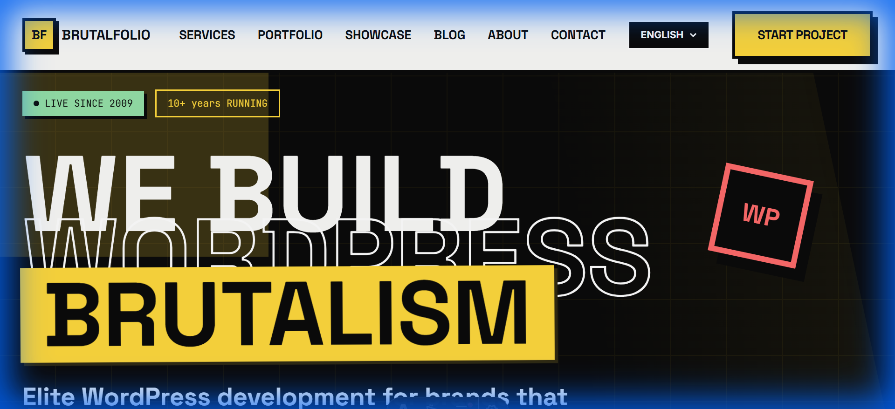

# Astro Brutalfolio

A bold, brutalist portfolio theme with multilingual support, GSAP + Framer Motion animations, and React islands.

[](./LICENSE)
[](https://astro.build)
[](https://react.dev)
[](https://tailwindcss.com)
[](https://gsap.com)
[](https://www.typescriptlang.org)



> **[Live Demo →](https://astro-brutalfolio-wpagencys-projects.vercel.app)**

## Features

- **Brutalist Design Aesthetic** - Raw, geometric design with bold typography and minimal ornamentation
- **Multilingual Support** - Built-in i18n for English, Spanish, and French content
- **GSAP + Framer Motion Animations** - Smooth scroll animations and interactive UI transitions
- **React Interactive Islands** - Lightweight React components for interactivity without bloat
- **Blog with WordPress Content** - Fetch and display articles from WordPress CMS
- **Mobile-First Responsive Design** - Optimized for screens from 320px to 4K
- **Dark Theme with Yellow Accents** - High-contrast brutalist color scheme with vibrant highlights
- **Custom Design Tokens** - Centralized design system for easy theme customization
- **TypeScript Support** - Full type safety throughout the project
- **SEO Optimized** - Automatic sitemap generation and meta tag management

## Quick Start

```bash
# Clone the repository
git clone https://github.com/wpagency/astro-brutalfolio.git

# Navigate to the project
cd astro-brutalfolio

# Install dependencies
npm install

# Start development server
npm run dev
```

Open [http://localhost:4321](http://localhost:4321) in your browser.

## Tech Stack

| Technology | Purpose |
|-----------|---------|
| Astro 5.x | SSG Framework - Zero JavaScript by default |
| React 18 | Interactive islands and UI components |
| GSAP 3.x | Professional scroll and timeline animations |
| Framer Motion | Smooth component entrance and interaction animations |
| Tailwind CSS 3 | Utility-first CSS framework for styling |
| TypeScript 5 | Type-safe development experience |

## Project Structure

```
astro-brutalfolio/
├── src/
│   ├── components/      # Reusable UI components
│   ├── layouts/         # Page layout templates
│   ├── pages/           # Route pages (EN, ES, FR)
│   ├── content/         # Markdown blog posts
│   ├── styles/          # Global styles and design tokens
│   └── utils/           # Utility functions and helpers
├── public/              # Static assets (images, fonts)
├── astro.config.mjs     # Astro configuration
├── tailwind.config.mjs  # Tailwind CSS configuration
└── package.json         # Project dependencies
```

## Environment Variables

Copy `.env.example` to `.env.local` and fill in your values:

```bash
cp .env.example .env.local
```

Available options:

```env
# WordPress Integration
WORDPRESS_API_URL=https://your-wordpress.com/wp-json
WORDPRESS_API_KEY=your-api-key

# Site Configuration
SITE_TITLE=Astro Brutalfolio
SITE_DESCRIPTION=A bold, brutalist portfolio
DEFAULT_LOCALE=en
```

See [.env.example](./.env.example) for all available options.

## Scripts

| Command | Description |
|---------|------------|
| `npm run dev` | Start local development server on port 4321 |
| `npm run build` | Build for production to `dist/` directory |
| `npm run preview` | Preview production build locally |
| `npm run type-check` | Check for TypeScript errors |
| `npm run lint` | Run ESLint on source files |

## Customization

### Design Tokens

Edit `src/styles/tokens.css` to customize the brutalist color scheme:

```css
:root {
  --color-bg-primary: #000000;
  --color-bg-secondary: #1a1a1a;
  --color-text-primary: #ffffff;
  --color-accent: #ffff00;
  --color-accent-secondary: #ff00ff;
}
```

### Multilingual Content

Add new language support by creating locale directories in `src/pages/`:

```
src/pages/
├── en/          # English content
├── es/          # Spanish content
├── fr/          # French content
```

Update language configuration in `astro.config.mjs`:

```javascript
i18n: {
  defaultLocale: 'en',
  locales: ['en', 'es', 'fr']
}
```

### Blog Posts

Add new blog posts as markdown files in `src/content/blog/`:

```markdown
---
title: "Your Post Title"
description: "Post description"
pubDate: "2024-01-15"
author: "Author Name"
---

Your content here...
```

### WordPress Integration

To fetch content from WordPress, configure the API URL in `.env.local` and use the provided utility functions:

```typescript
import { getWordPressPosts } from '@/utils/wordpress';

const posts = await getWordPressPosts();
```

## Deployment

### Netlify (Recommended)

1. Connect your GitHub repository to Netlify
2. Configure build settings:
   - Build command: `npm run build`
   - Publish directory: `dist`
3. Deploy

### Vercel

```bash
npm i -g vercel
vercel
```

### Self-Hosted

```bash
npm run build
# Upload the `dist` folder to your server
```

## Performance

This theme achieves excellent performance metrics:

- **Lighthouse Performance**: 95+/100
- **First Contentful Paint (FCP)**: < 1.0s
- **Largest Contentful Paint (LCP)**: < 1.5s
- **Cumulative Layout Shift (CLS)**: < 0.1

## Other Themes in This Collection

| Theme | Description | Demo |
|-------|------------|------|
| [Astro Romance](https://github.com/wpagency/astro-romance) | Romantic pink agency theme | [Demo](https://astro-romance-wpagencys-projects.vercel.app) |
| [Astro Starter](https://github.com/wpagency/astro-starter) | Full-featured Astro starter with Three.js | [Demo](https://astro-starter-wpagencys-projects.vercel.app) |
| [React Agency Genesis](https://github.com/wpagency/react-agency-genesis) | Premium agency funnel template | [Demo](https://react-agency-genesis-wpagencys-projects.vercel.app) |
| [React Parallax Foundry](https://github.com/wpagency/react-parallax-foundry) | 3D parallax website with R3F | [Demo](https://react-parallax-foundry-wpagencys-projects.vercel.app) |
| [React Pulse Robot](https://github.com/wpagency/react-pulse-robot) | WordPress showcase with Lottie | [Demo](https://react-pulse-robot-wpagencys-projects.vercel.app) |
| [React Rescue Odyssey](https://github.com/wpagency/react-rescue-odyssey) | Story-driven space theme with Supabase | [Demo](https://react-rescue-odyssey-wpagencys-projects.vercel.app) |
| [React Source Seeker](https://github.com/wpagency/react-source-seeker) | Interactive 3D storytelling with PWA | [Demo](https://react-source-seeker-wpagencys-projects.vercel.app) |

## Contributing

Contributions are welcome! Please see [CONTRIBUTING.md](./CONTRIBUTING.md) for guidelines.

## License

MIT License — see [LICENSE](./LICENSE) for details.

---

### Built by [WP Agency](https://wpagency.xyz) — WordPress and Beyond

With 15+ years of agency experience, we build production websites that perform. These open-source themes represent our commitment to the developer community.

**Need customization or a production build?** [Let's talk →](https://wpagency.xyz/contact)
